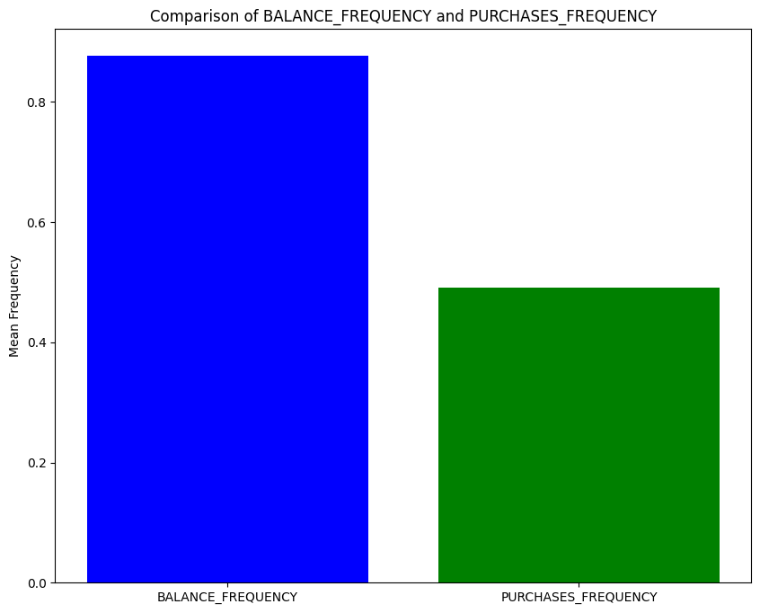

# Laporan Proyek Machine Learning

### Nama : Satrio Mukti Prayoga

### Nim : 211351137

### Kelas : Malam B

## Domain Proyek

Aplikasi streamlit ini dapat membantu tenaga penjualan agar pemasaran mereka lebih tepat sasaran dengan menganalisis penggunaan kartu kredit setiap orang dalam kumpulan data yang akan digunakan. Dengan demikian, tenaga penjualan atau pemasar dapat mengetahui pelanggan mana yang lebih berpotensi untuk membeli produk mereka dengan melihat pengelompokan pelanggan pada visualisasi algoritma K-means. Segmentasi atau pengelompokan dapat membantu dalam menyusun strategi pemasaran yang lebih efektif berdasarkan perilaku pengguna kartu kredit.

## Business Understanding

### Problem Statements

- Bagaimana cara meningkatkan penjualan agar pemasaran tepat sasaran?

### Goals

- Membuat segmentasi pelanggan berdasarkan perilaku penggunaan kartu kredit mereka, dengan menggunakan algoritma KMeans, sehingga penjualan dapat meningkat secara signifikan.

### Solution statements

Solution Statement 1: Menggunakan algoritma machine learning KMeans Clustering untuk membuat segmentasi pelanggan. Membandingkan hasil clustering tersebut dan memilih yang terbaik berdasarkan silhouette score.

Solution Statement 2: Membuat plot dan barplot untuk segmentasi pelanggan.

## Data Understanding

Data yang digunakan dalam proyek ini berasal dari sumber [kaggle](https://www.kaggle.com/) dan berisi informasi tentang perilaku penggunaan kartu kredit.

<br>

Link Dataset : [Card Usage](https://www.kaggle.com/datasets/noordeen/card-usage/)

### Variabel-variabel pada Dataset ini adalah sebagai berikut:

- CUST_ID: Identifikasi pemegang kartu kredit (Kategorikal) (object)
- BALANCE: Jumlah saldo yang tersisa di akun mereka untuk melakukan pembelian (float64)
- BALANCE_FREQUENCY: Seberapa sering Saldo diperbarui, skor antara 0 dan 1 (1 = diperbarui secara sering, 0 = tidak diperbarui secara sering) (float64)
- PURCHASES: Jumlah pembelian yang dibuat dari akun (float64)
- ONEOFF_PURCHASES: Jumlah pembelian maksimum yang dilakukan sekaligus (float64)
- INSTALLMENTS_PURCHASES: Jumlah pembelian yang dilakukan secara cicilan (float64)
- CASH_ADVANCE: Uang tunai yang diberikan oleh pengguna (float64)
- PURCHASES_FREQUENCY: Seberapa sering pembelian dilakukan, skor antara 0 dan 1 (1 = sering dibeli, 0 = tidak sering dibeli) (float64)
- ONEOFF_PURCHASES_FREQUENCY: Seberapa sering pembelian dilakukan sekaligus (1 = sering dibeli, 0 = tidak sering dibeli) (float64)
- PURCHASES_INSTALLMENTS_FREQUENCY: Seberapa sering pembelian dalam cicilan dilakukan (1 = sering dilakukan, 0 = tidak sering dilakukan) (float64)
- CASH_ADVANCE_FREQUENCY: Seberapa sering uang tunai di muka dibayar (float64)
- CASH_ADVANCE_TRX: Jumlah transaksi yang dilakukan dengan "Cash in Advanced"(int64)
- PURCHASES_TRX: Jumlah transaksi pembelian yang dilakukan (int64)
- CREDIT_LIMIT: Batas Kartu Kredit untuk pengguna (float64)
- PAYMENTS: Jumlah pembayaran yang dilakukan oleh pengguna (float64)
- MINIMUM_PAYMENTS: Jumlah pembayaran minimum yang dilakukan oleh pengguna (float64)
- PRC_FULL_PAYMENT: Persentase pembayaran penuh yang dilakukan oleh pengguna (float64)
- TENURE: Masa pelayanan kartu kredit untuk pengguna (int64)

## Data Preparation

Dataset "Card Usage" didapat dari website [kaggle](https://www.kaggle.com/)

disini saya akan mengkoneksikan google colab ke kaggle menggunakan token dari akun saya :

```bash
from google.colab import files
files.upload()
```

disni saya akan membuat direktori untuk menyimpan file kaggle.json

```bash
!mkdir -p ~/.kaggle
!cp kaggle.json ~/.kaggle/
!chmod 600 ~/.kaggle/kaggle.json
!ls ~/.kaggle
```

saya akan mendownload file datasetnya dari kaggle :

```bash
!kaggle datasets download -d noordeen/card-usage
```

disini saya mengekstrak file dari dataset yang sudah saya download :

```bash
!unzip card-usage.zip
```

lalu saya akan membuat EDA, dengan menggunakan beberapa library, pertama saya akan import beberapa library yang akan dipakai :

```bash
import numpy as np
import pandas as pd
import matplotlib.pyplot as plt
%matplotlib inline
import seaborn as sns
from sklearn.cluster import KMeans
from sklearn.preprocessing import StandardScaler
from sklearn.metrics import silhouette_score

import warnings
warnings.filterwarnings("ignore")
```

Disini saya akan memanggil dan menyimpan dataset di variabel df dengan menggunakan kode sebagai berikut :

```bash
df = pd.read_csv('CreditCardUsage.csv')
```

Setelah dataset disimpan di variabel df, saya akan melihat jumlah baris data dan featurenya.

```bash
df.shape
```

Saya juga melihat ada semua featurenya

```bash
df.columns
```

Setelah saya cek feature yang ada, saya juga ingin mengetahui 5 baris data awal pada setiap featurenya.

```bash
df.head()
```

Setelah itu, saya ingin melihat berapa data null yang ada pada dataset dan pada feature apa saja data null tersebut berada.

```bash
df.isnull().sum()
```

Saya juga harus tau tipe data pada setiap masing masing feature/column.

```bash
df.info()
```

Disini saya akan menampilkan count, mean, std, min dan max pada dataset.

```bash
df.describe().T
```

Disini saya akan membuat visualisasi distribusi pembelian (Purchases) dalam DataFrame df.

```bash
plt.figure(figsize=(10, 8))

sns.distplot(df['PURCHASES'], color='orange', bins=150)
plt.title('Distribution of Purchases', size=20)
plt.xlabel('Purchases')
```


Saya juga akan menunjukkan distribusi pembelian satu kali (One Off Purchase) dan distribusi pembelian cicilan (Installment Purchase) dari DataFrame df.

```bash
# Create a figure with subplots
fig, axes = plt.subplots(1, 2, figsize=(15, 6))

# Plot the first subplot
sns.distplot(df['ONEOFF_PURCHASES'], color='green', ax=axes[0])
axes[0].set_title('Distribution of One Off Purchase', fontsize=20)
axes[0].set_xlabel('Amount')

# Plot the second subplot
sns.distplot(df['INSTALLMENTS_PURCHASES'], color='red', ax=axes[1])
axes[1].set_title('Distribution of Installment Purchase', fontsize=20)
axes[1].set_xlabel('Amount')

plt.show()
```


Saya juga ingin membuat heatmap. Warna pada heatmap menggambarkan tingkat korelasi, di mana warna yang lebih terang menunjukkan korelasi yang lebih tinggi, sedangkan warna yang lebih gelap menunjukkan korelasi yang lebih rendah atau tidak ada korelasi.

```bash
plt.figure(figsize=(10, 8))
sns.heatmap(df.corr())
```


Saya akan membuat diagram lingkaran (pie chart) yang membandingkan persentase total saldo dan total pembelian dalam dataset.

```bash
# Ambil data saldo dan pembelian
balance_sum = df['BALANCE'].sum()
purchases_sum = df['PURCHASES'].sum()

# Hitung persentase
balance_percentage = (balance_sum / (balance_sum + purchases_sum)) * 100
purchases_percentage = (purchases_sum / (balance_sum + purchases_sum)) * 100

# Data untuk plot
labels = ['Balance', 'Purchases']
sizes = [balance_percentage, purchases_percentage]
colors = ['lightblue', 'lightgreen']

# Plot pie chart
plt.figure(figsize=(10, 8))

plt.pie(sizes, labels=labels, colors=colors, autopct='%1.1f%%', startangle=90)
plt.axis('equal')  # Memastikan lingkaran berbentuk bulat
plt.title('Percentage Comparison of Balance and Purchases')
plt.show()
```


Kode dibawah ini digunakan untuk membuat diagram batang (bar chart) yang membandingkan rata-rata frekuensi saldo (BALANCE_FREQUENCY) dan rata-rata frekuensi pembelian (PURCHASES_FREQUENCY) dalam dataset. Warna biru digunakan untuk kategori 'BALANCE_FREQUENCY', sedangkan warna hijau digunakan untuk kategori 'PURCHASES_FREQUENCY'.

```bash
# Data untuk plot
categories = ['BALANCE_FREQUENCY', 'PURCHASES_FREQUENCY']
values = [df['BALANCE_FREQUENCY'].mean(), df['PURCHASES_FREQUENCY'].mean()]

# Plot bar chart
plt.figure(figsize=(10, 8))
plt.bar(categories, values, color=['blue', 'green'])
plt.ylabel('Mean Frequency')
plt.title('Comparison of BALANCE_FREQUENCY and PURCHASES_FREQUENCY')
plt.show()
```



lalu saya akan membandingkan distribusi dari BALANCE_FREQUENCY dengan PURCHASES_FREQUENCY

```bash
# Plot histogram
plt.figure(figsize=(12, 6))

# Distribusi BALANCE_FREQUENCY
plt.subplot(1, 2, 1)
sns.histplot(df['BALANCE_FREQUENCY'], kde=True, bins=30, color='blue')
plt.title('Distribution of BALANCE_FREQUENCY')

# Distribusi PURCHASES_FREQUENCY
plt.subplot(1, 2, 2)
sns.histplot(df['PURCHASES_FREQUENCY'], kde=True, bins=30, color='green')
plt.title('Distribution of PURCHASES_FREQUENCY')

plt.tight_layout()
plt.show()
```


Scatter plot dibawah ini dapat membantu mengidentifikasi apakah pengguna dengan saldo yang tinggi cenderung melakukan pembelian dalam jumlah besar atau sebaliknya.

```bash
plt.figure(figsize=(10, 8))
sns.scatterplot(x=scaled_X[:, 0], y=scaled_X[:, 2], hue=clusters_kmeans, palette=sns.color_palette('hls', n_colors=len(np.unique(clusters_kmeans))), marker='o', s=50)

for label in np.unique(clusters_kmeans):
    plt.annotate(label,
                 (scaled_X[clusters_kmeans == label, 0].mean(),
                  scaled_X[clusters_kmeans == label, 2].mean()),
                 horizontalalignment='center',
                 verticalalignment='center',
                 size=20, weight='bold',
                 color='black')

plt.xlabel('BALANCE')
plt.ylabel('PURCHASES')
plt.title('Cluster Plot with Cluster Centers')
plt.legend()
plt.show()
```


Pada tahap preprocessing ini, saya hanya akan drop feature CUST_ID dan mengisi data null dengan median.

```bash
df.drop(['CUST_ID'], axis=1, inplace=True)

df['CREDIT_LIMIT'].fillna(df['CREDIT_LIMIT'].median(), inplace=True)
df['MINIMUM_PAYMENTS'].fillna(df['MINIMUM_PAYMENTS'].median(), inplace=True)

df.describe().T
```

## Modeling

Langkah awal yang akan saya lakukan adalah menggunakan sebuah alat (scaler) dalam library scikit-learn yang digunakan untuk mentransformasi dataset agar memiliki rata-rata nol dan deviasi standar satu.

```bash
X = df.values[:]
X = np.nan_to_num(X)
scaled_X = StandardScaler().fit_transform(X)
scaled_X
```

Sekarang saya akan nmencari elbownya.

```bash
inertia_values = []
for i in range(1, 11):
    kmeans = KMeans(n_clusters=i).fit(scaled_X)
    inertia_values.append(kmeans.inertia_)

fig, ax = plt.subplots(figsize=(12, 8))
sns.lineplot(x=list(range(1, 11)), y=inertia_values, ax=ax)
ax.set_title('Mencari Elbow')
ax.set_xlabel('Clusters')
ax.set_ylabel('Inertia')

plt.show()
```


Disini saya akan memakai n_cluster=3 untuk modellingnya.

```bash
kmeans = KMeans(n_clusters=3).fit(scaled_X)
print(kmeans.cluster_centers_)
kmeans_labels = kmeans.labels_
```

dan menambahkan kolom baru bernama Cluster ke df.

```bash
clusters_kmeans = kmeans.labels_ + 1
df["cluster"] = clusters_kmeans
df.head()
```

## Evaluation

Berdasarkan hasil dari kode dibawah, didapatkan n_clusters=3, the silhouette score is 0.2506116638886035. Dalam Silhouette Coefficient, semakin tinggi skornya, semakin baik. Skor Silhouette berkisar antara -1 hingga 1, Skor Positif Tinggi (dekat +1): Ini menunjukkan bahwa klaster tersebut merupakan klaster yang baik.

```bash
range_n_clusters = [2, 3, 4, 5, 6, 7, 8]

for num_clusters in range_n_clusters:
    # intialise kmeans
    kmeans = KMeans(n_clusters=num_clusters)
    kmeans.fit(scaled_X)

    cluster_labels = kmeans.labels_

    # silhouette score
    silhouette_avg = silhouette_score(scaled_X, cluster_labels)
    print("For n_clusters={0}, the silhouette score is {1}".format(num_clusters, silhouette_avg))

# Output :
# For n_clusters=2, the silhouette score is 0.20951389891150402
# For n_clusters=3, the silhouette score is 0.25063686531646423
# For n_clusters=4, the silhouette score is 0.19797118701242603
# For n_clusters=5, the silhouette score is 0.19327119581091734
# For n_clusters=6, the silhouette score is 0.20273049886535538
# For n_clusters=7, the silhouette score is 0.20816099649668712
# For n_clusters=8, the silhouette score is 0.21289020202242545
```

## Deployment

Berikut link menuju app [Segmentasi Pelanggan Berdasarkan Penggunaan Kartu Kredit](https://uas-kmeans-card-satrio-malamb.streamlit.app/)

